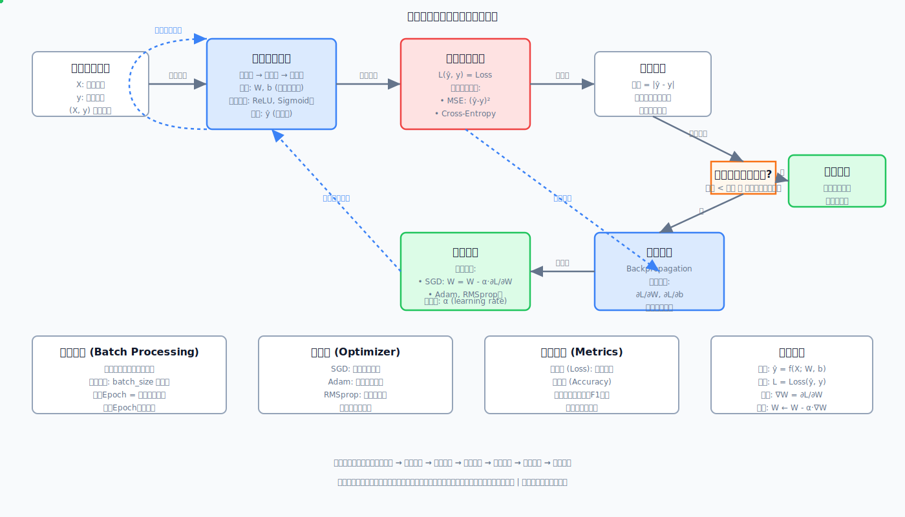

# LLMSAPP


## 一、人工智能、机器学习、AIGC、深度学习和大模型关系图 


正确的层次关系：

- AI（人工智能） - 最顶层，包含所有智能系统
- ML（机器学习） - AI 的子集，让机器从数据中学习
- DL（深度学习） - ML 的子集，使用神经网络
- LLM（大语言模型） - DL 的应用，特别是基于 Transformer 的模型
- AIGC（AI生成内容） - AI 的应用领域，通常使用 LLM 等技术





开源项目数据IE

[斯坦福](https://github.com/tatsu-lab/stanford_alpaca)

[Alpaca GPT4](alpaca_gpt4_data.json)

[LIMA:](https://huggingface.co/datasets/GAIR/lima)
 


[大模型哪些东西](/大模型哪些东西.md)


 

## 二、 AI前沿技术


[2024年AIGC之2025年大模型应用落地发展预测](2024_AIGC.md)


[2025年AI新范式中最具突破性的技术](2025年AI新范式中最具突破性的技术.md)


## 二、 大模型工具

[Ollama是一个开源工具，旨在简化大型语言模型的本地化部署和使用，支持CPU/GPU混合计算，适用于隐私保护、成本控制等场景](https://ollama.com/)

[MaxKB]()


## 三、 深度学习基本理论

[3、梯度下降](/deeplearn/3.梯度下降.md)

[4、学习率](/deeplearn/4.学习率.md)

[5、逻辑回归](/deeplearn/5.逻辑回归.md)

[6、逻辑回归之激活函数](/deeplearn/6.逻辑回归之激活函数(Sigmoid).md)


[7、深度神经网络与前向传播](/deeplearn/7.深度神经网络与前向传播.md)

[8、深度学习中激活函数](/deeplearn/8.深度学习中激活函数.md)

[9、深度学习神经网络的反向传播与计算图](/deeplearn/9.深度学习神经网络的反向传播与计算图.md)


## 四、深度神经网络训练参数优化篇

[1、向量化与矩阵化.md](/deeplean_tran/1、向量化与矩阵化.md)

[2、深度神经网络之L2正则化.md](/deeplean_tran/2、深度神经网络之L2正则化.md)

[3、深度神经网络之Dropout.md](/deeplean_tran/3、深度神经网络之Dropout.md)

[4、深度神经网络之数据归一化处理.md](/deeplean_tran/4、深度神经网络之数据归一化处理.md)

[5、深度神经网络之初始化权重参数.md](/deeplean_tran/5、深度神经网络之初始化权重参数.md)

[6、深度神经网络之全批量梯度下降、随机梯度下降和小批量梯度下降(mini-batch size)](/deeplean_tran/6、深度神经网络之全批量梯度下降、随机梯度下降和小批量梯度下降.md)

[7、深度神经网络之梯度参数调优](/deeplean_tran/7、深度神经网络之梯度参数调优.md)


[8、深度神经网络之参数优化(BatchNormaliztion)](/deeplean_tran/8、深度神经网络之参数优化(BatchNormaliztion).md)


## 五、训练大语言模型的不同阶段


分为三大步


```javascript

pip install jupyter
pip install matplotlib
```


### 1. 准备阶段


#### ① 数据采集与初步处理

- 通过网络爬虫抓取数据
- 数据格式化， 将HTML转成纯文本

#### ②、文本标准化与格式统一

1. 统一编码， 全部转为utf-8格式
2. 去掉各种HTML标签或JSON标识
3. 处理特殊字符：乱码、表情符...
4. 去掉多余的空格、空行
5. 将所有大写字符转成小写字符（英文）

#### ③、噪声去除与内容概率

1. 删除重复数据
2. 删除过短或者信息量不足的内容
3. 过滤掉广告、导航、模板文本
4. 过滤掉色情、暴力等信息


[1、文本向量化](/02.文本与分词/1、文本向量化.md)

[2、构建文本字典原理](/02.文本与分词/2、构建文本字典原理.md)

[3、Tokenize类封装](/02.文本与分词/3、Tokenizer类封装.md)

[4、基于统计的分词技术(tiktoken)](/02.文本与分词/4、基于统计的分词技术.md)

[5、文本向量化(Embedding).md](/02.文本与分词/5、文本向量化(Embedding).md)


### 2. 预训练阶段


[5、注意力机制](/05.注意力机制/README.md)


[6、Transformer神秘架构](/06.Transformer架构神秘/README.md)

[7. 交叉熵损失函数 torch.nn.funcational.cross_entropy(...)]()


### 3. 微调与应用


[斯坦福]()

[1、模型评分](07.模型微调/模型评分.md)


[2、LoRA(Low-Rank Adaptation)](LoRA模型微调.md)


### 4、 知识蒸馏


[黑盒和白盒蒸馏](/08.知识蒸馏/README.md)


 


