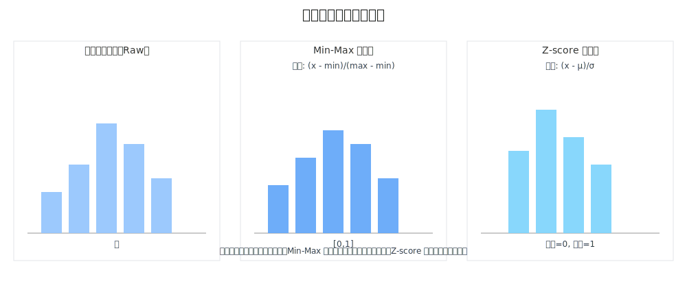
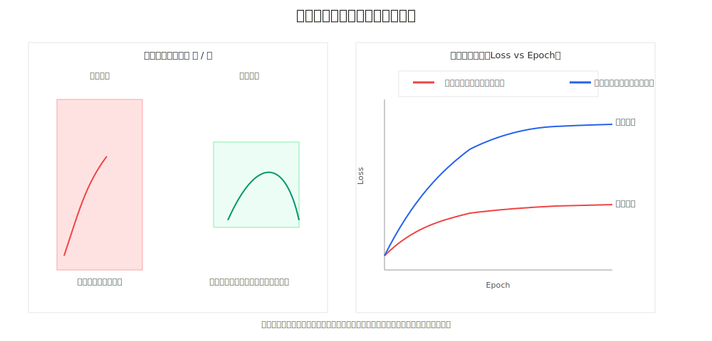
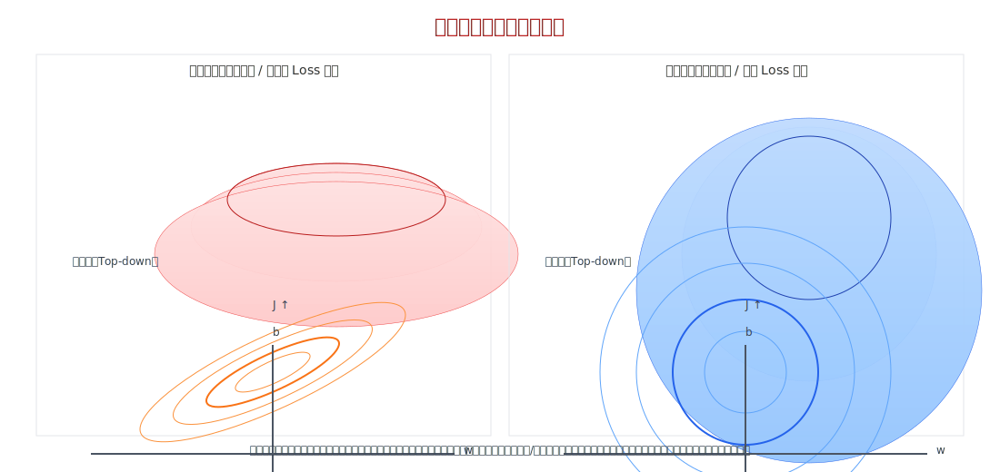
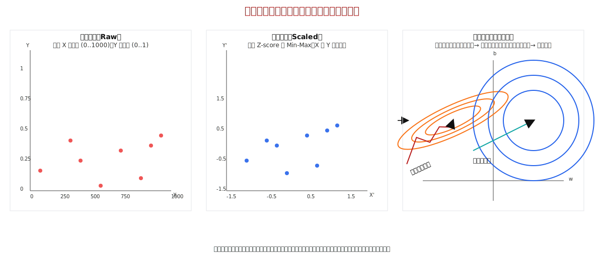
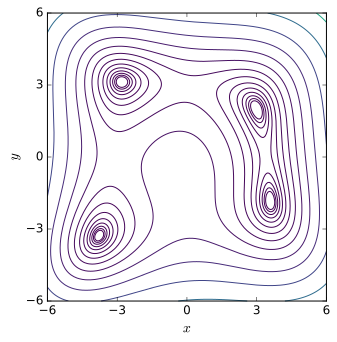

# 深度神经网络之数据归一化处理

##  输入数据归一化的好处

1. 加快收敛速度： 归一化使不同特征大小相似
2. 避免梯度消失： 归一化可以防止输入范围过大或过小
3. 提高模型的稳定性和泛化性
4. 简化特征空间的映射关系
 
 ## 经典图与效果图

 下列图示展示常见的归一化方法及其对特征分布与训练收敛的影响。

 - 方法示意：`normalization_methods.svg`（Min-Max、Z-score 等）
 - 效果对比：`normalization_effects.svg`（归一化前后分布与 Loss 收敛对比）

 

 

 简要说明：
 - Min-Max 归一化将特征线性缩放到 [0,1]（对异常值敏感）。
 - Z-score 标准化将特征中心化为均值 0、方差 1，常用于对尺度敏感的优化器。
 - 在大多数深度学习训练中进行归一化可加速收敛并提高数值稳定性。
 
 ## 条件数与损失面示意

 下图参考示意：左为未归一化时的损失面（扁长椭圆，对应高条件数），右为归一化后的对称损失面（低条件数）。

 

 简要说明：
 - 左图：等高线拉伸，优化器在不同方向的步长不一致，容易导致收敛慢或震荡；
 - 右图：等高线接近圆形，梯度方向更一致，收敛更稳定且更快。

 ## 更清晰的示意（推荐）

 我按你的参考重画了一张更清晰的图，直接展示：
 - 左：归一化前的原始数据（X 与 Y 不同量级）
 - 中：归一化后的数据（相近尺度，点云被拉回）
 - 右：等高线与优化路径对比（未归一化的震荡路径 vs 归一化的平滑路径）

 

 该图意在直观显示归一化如何改变数据分布及损失面的几何形状，从而影响优化器的行为。

## 外部参考图像（示例与来源）

下面是从公开资源收集的示意图（供教学参考）。在公开发布或转载时，请根据下列来源页面核验并遵守具体许可条款。

- `deeplean_tran/external_images/Gradient_descent.svg` — Gradient descent 等高线示意（来源：Wikimedia Commons，通常为 CC BY/CC BY-SA，详情见文件页面）。
- `deeplean_tran/external_images/Error_surface_of_a_linear_neuron_with_two_input_weights.png` — 线性神经元的误差面示意（来源：Wikimedia Commons）。
- `deeplean_tran/external_images/Himmelblau_contour.svg` — Himmelblau 函数等高线（示例损失面，来源：Wikimedia Commons）。
- `deeplean_tran/external_images/Contour2D.svg` — 通用等高线示例（Wikimedia Commons）。
- `deeplean_tran/external_images/cs231n_prepro1.jpeg` — CS231n 课程：数据预处理示意（中心化 + 标准化）。
- `deeplean_tran/external_images/cs231n_prepro2.jpeg` — CS231n 课程：PCA / Whitening 示例。
- `deeplean_tran/external_images/cs231n_svm_all.jpg` — CS231n 课程：SVM 损失 2D/等高线示意。
- `deeplean_tran/external_images/cs231n_stepsize.jpg` — CS231n 课程：步长/学习率示意图。

插图预览：

**使用与版权说明**：
- Wikimedia Commons 上的文件通常标明具体许可（如 CC BY-SA / 公有领域等），请在文档或幻灯片中保留原作者/来源链接以符合法律要求；
- CS231n 课程教材图片用于教学/参考通常允许课堂使用，但若要对外发布或商业使用，请参考课程页面或联系原作者获得明确许可。

如需我把每张图的来源链接和许可文本直接写入文末的引用列表（带可点击 URL），我可以继续替你抓取并自动插入。

